**教程目标**: 帮助初学者从零开始理解微服务架构和 Pig 项目的系统运作流程

**前置知识**：Spring Boot 开发基础、对微服务架构各个核心组件的概念有一定了解

> 声明：本文使用 Claude Code、NVIDIA AI、DeepSeek、Gemini Pro 辅助生成

---

## 第一讲: 从单体到分布式

### 1.1 什么是单体架构?

如果你只做过 Spring Boot 单体项目, 那你一定很熟悉这种结构:  *（tips: 此文章使用 Mermaid 技术进行图表渲染，如果你在下面看到了 Mermaid 原始语句文本，请稍作等待）* 

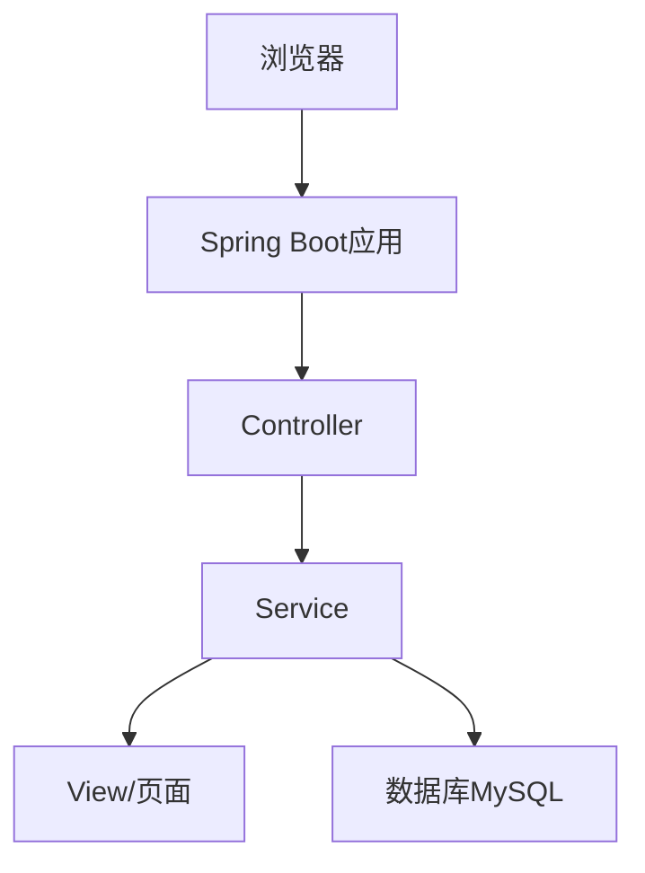
```mermaid
%%%%%%%%%% 如果你看到了这行文字，说明 Mermaid 图表尚未完成加载，请稍作等待 %%%%%%%%%%
flowchart TD
    A[浏览器] --> B[Spring Boot应用]
    B --> C[Controller]
    C --> D[Service]
    D --> E[View/页面]
    D --> F[数据库MySQL]
```

**特点**: 所有功能都在一个应用中, 一个 jar/war 包就搞定!

**优点**:
- ✅ 简单易懂
- ✅ 部署方便
- ✅ 开发迅速

### 1.2 单体架构会遇到什么问题?

假设你的网站越做越大...一次促销活动期间:

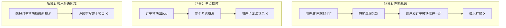
```mermaid
graph TD
    subgraph sg3["场景3: 性能瓶颈"]
        A["用户说“网站好卡!”"] --> B[想扩展服务器]
        B --> C[用户和订单模块混在一起]
        C --> D[难以扩展 ❌]
    end

    subgraph sg2["场景2: 单点故障"]
        E[订单模块出bug] --> F[整个系统崩溃]
        F --> G[用户也无法登录 ❌]
    end

    subgraph sg1["场景1: 技术升级困难"]
        H[想把订单模块换成新技术] --> I[必须重写整个项目 ❌]
    end
```

### 1.3 从单体架构到微服务

在正式进入微服务之前，我们首先要理解什么是**分布式**。简单来说，**分布式**是指将系统部署在多台不同的服务器（节点）上，通过网络协同工作。无论你是一个大单体拆成几份部署，还是拆成很多小服务部署，只要在多台机器上跑，就叫分布式。

早期的分布式架构可能只是把一个大系统复制几份部署到不同机器上（集群），或者按层级拆分（如前端、后端、数据库分离）。但随着业务复杂度上升，我们面临一个问题：代码依然臃肿，修改一个功能可能要重构整个系统。

为了解决这个问题，微服务架构应运而生。它是分布式架构的一种最佳实践，强调 “拆得彻底、治得独立”。

**微服务就是把一个复杂的单体应用拆分成多个独立的小服务，每个服务聚焦于一个具体的业务功能，并拥有独立的数据库和独立的部署流程。**

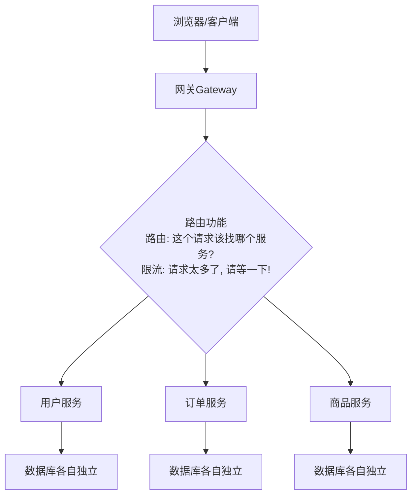
```mermaid
graph TD
    A[浏览器/客户端] --> B[网关Gateway]
    B --> C{路由功能
路由: 这个请求该找哪个服务?
限流: 请求太多了, 请等一下!}
    C --> D[用户服务]
    C --> E[订单服务]
    C --> F[商品服务]
    D --> G[数据库各自独立]
    E --> H[数据库各自独立]
    F --> I[数据库各自独立]
```

**特点**: "专人专职", 每个服务可以独立开发、部署、扩展

**好处**: 
- ✅ 高可用 (一个服务挂了不影响其他)
- ✅ 易扩展 (哪个服务压力大就扩哪个)
- ✅ 技术自由 (用最适合的语言/技术)
- ✅ 团队独立 (不同团队开发不同服务)

---

## 第二讲: Pig 项目整体架构初探

### 2.1 Pig 项目是什么?

Pig 是一个**企业级的快速开发平台**, 它实现了完整的 RBAC (基于角色的访问控制) 用户权限系统。

**用大白话说**: 这是一个"带用户管理的后台系统模板", 你拿了就能直接用!

### 2.2 Pig 项目技术栈

| 技术 | 版本 | 作用 |
|------|------|------|
| Java | 17 | 编程语言 |
| Spring Boot | 3.5.11 | 应用框架 |
| Spring Cloud | 2025.0.1 | 微服务框架 |
| Spring Cloud Alibaba | 2025.0.0.0 | 微服务增强 |
| Spring Authorization Server | 1.5.2 | OAuth2认证 |
| Mybatis Plus | 3.5.15 | 数据库操作 |
| MySQL | - | 数据库 |
| Redis | 8.6.2 | 缓存 |
| Nacos | - | 服务注册与配置中心 |

### 2.3 Pig 项目六大核心模块

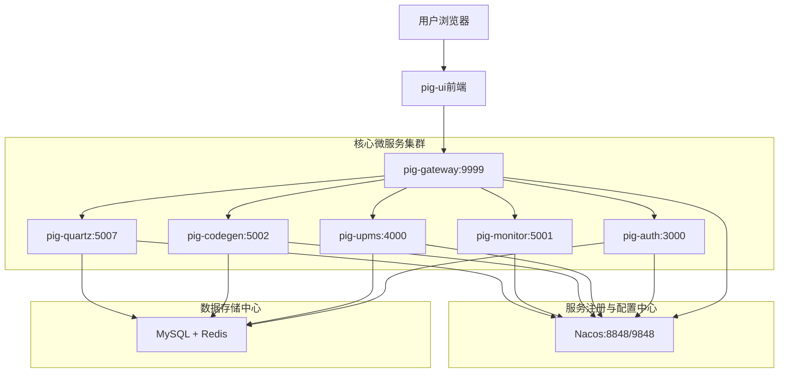
```mermaid
flowchart TB
    A[用户浏览器]
        B[pig-ui前端]
    subgraph Core[核心微服务集群]
        direction TB
        C[pig-gateway:9999]

        C --> D[pig-auth:3000]
        C --> E[pig-upms:4000]
        C --> F[pig-codegen:5002]
        C --> G[pig-monitor:5001]
        C --> H[pig-quartz:5007]
    end

    A --> B
    B --> C

    subgraph Nacos[服务注册与配置中心]
        I[Nacos:8848/9848]
    end

    subgraph Data[数据存储中心]
        J[MySQL + Redis]
    end

    C --> I
    D --> I
    E --> I
    F --> I
    G --> I
    H --> I

    D --> J
    E --> J
    F --> J
    H --> J
```

**六大核心模块**: 这些模块在项目根目录的 `docker-compose.yml` 中定义，使用 Docker Compose 可以一键启动所有服务。如果你不熟悉 Docker，不用担心，附录 C 提供了常用命令和容器基本概念，帮助你快速上手。

1. **pig-register** (8848): Nacos注册中心 - "所有服务的地址簿"
2. **pig-gateway** (9999): 网关 - "系统的统一入口"
3. **pig-auth** (3000): 认证服务 - "负责用户登录、颁发token"
4. **pig-upms** (4000): 权限服务 - "用户、角色、菜单管理"
5. **pig-visual**: 可视化监控模块
   - **pig-monitor** (5001): 服务监控 - "看所有服务的健康状态"
   - **pig-codegen** (5002): 代码生成 - "自动帮你生成增删改查代码"
   - **pig-quartz** (5007): 定时任务 - "管理定时任务"
6. **pig-common**: 公共组件 - "所有服务共享的工具"

> **💡Tips 启动方式选择**：如果你是第一次接触分布式项目，建议先使用 **IDE 方式启动**（见附录 E），这样可以更直观地观察每个服务的启动日志和调试代码。等你熟悉了整个流程，再尝试用 Docker Compose 一键启动。两种方式任选其一，不必一开始就纠结 Docker。

### 2.4 类比理解: 把PIG想象成一个大型公司

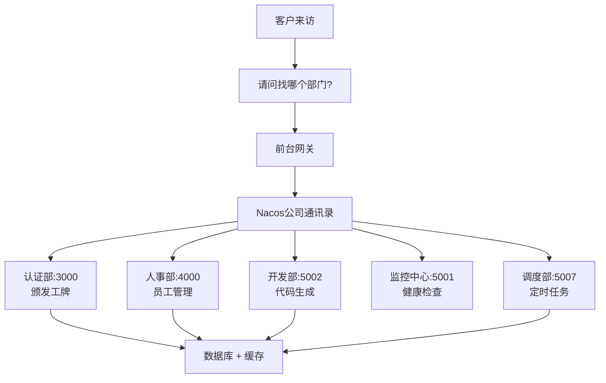
```mermaid
graph TD
    A[客户来访] --> B["请问找哪个部门?"]
    B --> C[前台网关]
    C --> D[Nacos公司通讯录]

    D --> E[认证部:3000
颁发工牌]
    D --> F[人事部:4000
员工管理]
    D --> G[开发部:5002
代码生成]
    D --> H[监控中心:5001
健康检查]
    D --> I[调度部:5007
定时任务]

    E --> J[数据库 + 缓存]
    F --> J
    G --> J
    I --> J
```

### 2.5 模块间的依赖关系（Maven多模块）

Pig 项目使用 Maven 多模块结构，各个业务模块（如 `pig-upms-biz`）都依赖公共模块 `pig-common`。在 `pig-upms-biz/pom.xml` 中可以看到：

```xml
<dependency>
    <groupId>com.pig4cloud</groupId>
    <artifactId>pig-common-core</artifactId>
</dependency>
```

`pig-common` 提供了通用工具类、异常处理、Feign 接口定义等，所有业务模块通过这种方式复用代码。如果你新增一个模块，记得在它的 `pom.xml` 中添加对 `pig-common` 的依赖。

### 2.6 Maven 多模块的逻辑

当你第一次打开 PIG 源码，可能会被几十个 `pom.xml` 绕晕。请记住这个公式：父工程管版本，公共模块管工具，业务模块管逻辑。

- 根目录 `pom.xml`：它是“大管家”，不写代码，只负责定义所有依赖的版本号。
- `pig-common`：它是“工具箱”。如果你修改了这里的代码，必须在根目录执行 `mvn install`，否则业务模块（如 UPMS）里引用的还是旧的代码包。

> 💡 初学者必知：如果你在 `pig-upms` 里调不通某个工具类，先检查 `pig-upms-biz` 的 `pom.xml` 是否引入了对应的工具包。

---

## 第三讲: 注册中心 - 服务的"电话簿"

### 3.1 为什么需要注册中心?

想象一下: 你的公司有10个部门, 每个部门的电话都可能变动, 你怎么找他们?

**笨办法**: 每个员工都存一份通讯录, 每次变动都要通知所有人更新 😰

**聪明办法**: 有一个"公司通讯录"(Nacos), 所有部门都在上面注册自己的信息, 谁要找人就查这个通讯录 😊

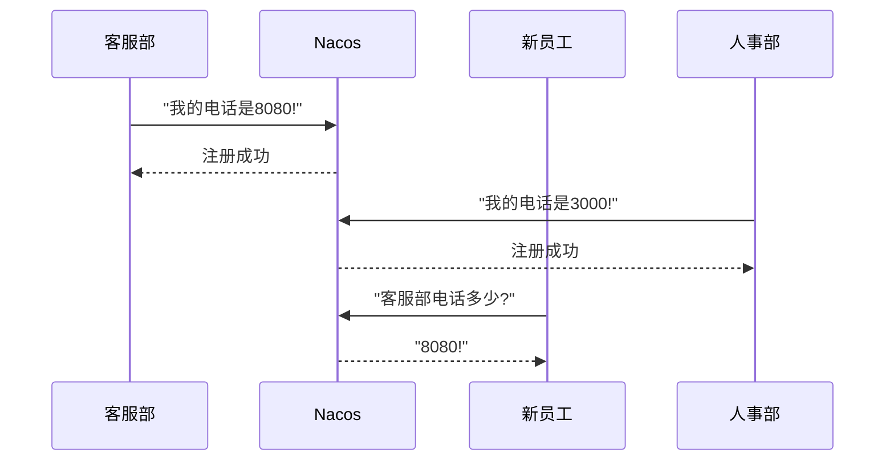
```mermaid
sequenceDiagram
    participant 客服部
    participant Nacos
    participant 新员工

    客服部->>Nacos: "我的电话是8080!"
    Nacos-->>客服部: 注册成功

    人事部->>Nacos: "我的电话是3000!"
    Nacos-->>人事部: 注册成功

    新员工->>Nacos: "客服部电话多少?"
    Nacos-->>新员工: "8080!"
```

### 3.2 Nacos 注册中心的作用

1. **服务注册**: 每个服务启动时告诉 Nacos: "我叫xxx, 我的地址是xxx"
2. **服务发现**: 服务需要调用别人时, 问 Nacos: "xxx服务的地址是什么?"
3. **健康检查**: Nacos 定期检查服务: "你还活着吗?"
4. **配置管理**: 所有服务的配置文件都集中存放在 Nacos

### 3.3 实际操作: 看看 Nacos 里有什么

启动 Nacos 后访问: `http://localhost:8848`

账号: `nacos` 密码: `nacos`

你会看到:
- **服务列表**: 所有注册的服务(`pig-gateway`, `pig-auth` 等)
- **配置列表**: 所有服务的配置文件
- **命名空间**: 隔离不同环境(`dev`, `test`, `prod`)

### 3.4 配置管理有多重要?

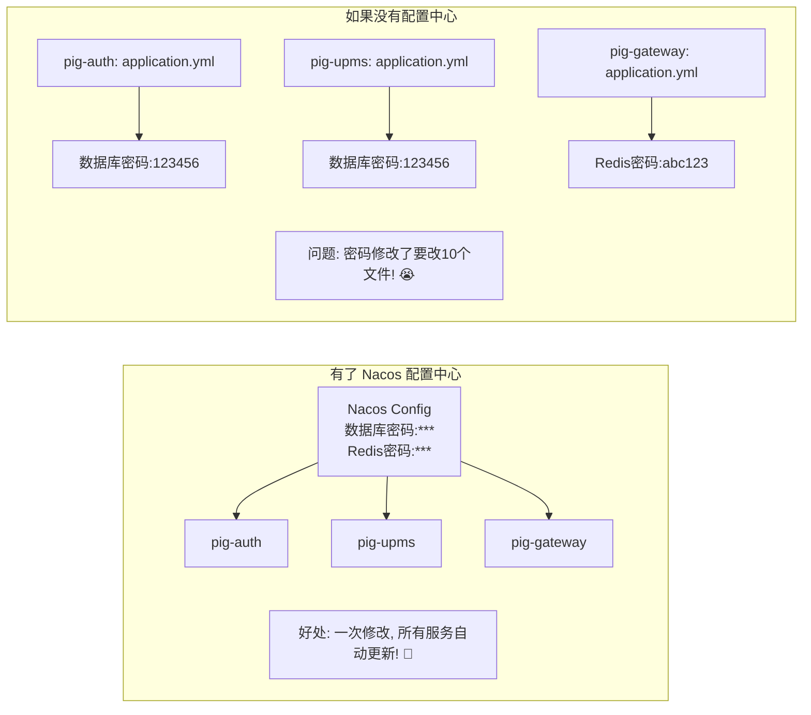
```mermaid
graph TD
    subgraph sg1["如果没有配置中心"]
        A["pig-auth: application.yml"] --> B["数据库密码:123456"]
        C["pig-upms: application.yml"] --> D["数据库密码:123456"]
        E["pig-gateway: application.yml"] --> F["Redis密码:abc123"]
        G["问题: 密码修改了要改10个文件! 😭"]
        B ~~~ G
        D ~~~ G
        F ~~~ G
    end

    subgraph sg2["有了 Nacos 配置中心"]
        H["Nacos Config<br/>数据库密码:***<br/>Redis密码:***"] --> I[pig-auth]
        H --> J[pig-upms]
        H --> K[pig-gateway]
        L["好处: 一次修改, 所有服务自动更新! 🎉"]
        I ~~~ L
        J ~~~ L
        K ~~~ L
    end

    G ~~~ H
```

注意：有了 Nacos 配置中心，所有服务的配置文件都集中在 Nacos 管理，但并不表示服务不需要单独的配置文件。有一些必要的配置必须保留在本服务中，例如应用名、Nacos 服务器地址等启动时必须知道的信息需要放在本服务的 `application.yml` 中，其余业务配置（数据库地址、Redis 配置、业务参数等）都可以放在 Nacos 中，实现动态刷新。

> **版本变化**：Spring Cloud 2020.0.x 之前的版本，会优先加载 `bootstrap.yml` 而不是 `application.yml`。Spring Cloud Alibaba 2025.1.0.0 已经全面废弃 `bootstrap.yml`。新版本应在 `application.yml` 中通过 `spring.config.import` 显式导入配置中心，例如：
>
> ```yaml
> spring:
>   config:
>     import: nacos:my-service.yml?refreshEnabled=true
> ```

> 为什么我的本地配置不生效？
>
> 配置存在优先级，你的配置可能被更高级配置覆盖了，最新版中： `命令行参数 > 环境变量 > Nacos远程配置 > 本地`application.yml` > `bootstrap.yml`(若启用)`

> 💡 进阶技巧：如果你想在代码里修改配置后立即生效而不重启服务，需要在对应的类上加上 `@RefreshScope` 注解。

### 3.5 服务发现：代码里怎么“问”Nacos？

当服务 A 需要调用服务 B 时，不需要在代码里写死 IP 地址，而是通过服务名（即 `spring.application.name`）来定位。Spring Cloud 提供了两种常用方式：

- 负载均衡客户端：在网关配置中，我们看到的 `uri: lb://pig-auth` 就是告诉 Spring Cloud Gateway：请从 Nacos 获取名为 `pig-auth` 的服务地址，并用负载均衡算法选择其中一个实例调用。

- Feign 声明式客户端（见第八讲）：编写接口并用 `@FeignClient("pig-upms")` 标注，Spring 会自动生成实现类，调用时会自动向 Nacos 查询 `pig-upms` 的地址并发起 HTTP 请求。

**关键注解**：在服务的启动类上添加 `@EnableDiscoveryClient`（或不显式使用注解，而是使用自动配置），才能让服务在启动时将自己注册到 Nacos，也让本服务具备发现其他服务的能力。

---

## 第四讲: 网关 - 系统的"大门"

### 4.1 为什么需要网关?

想象一下, 没有网关的场景:

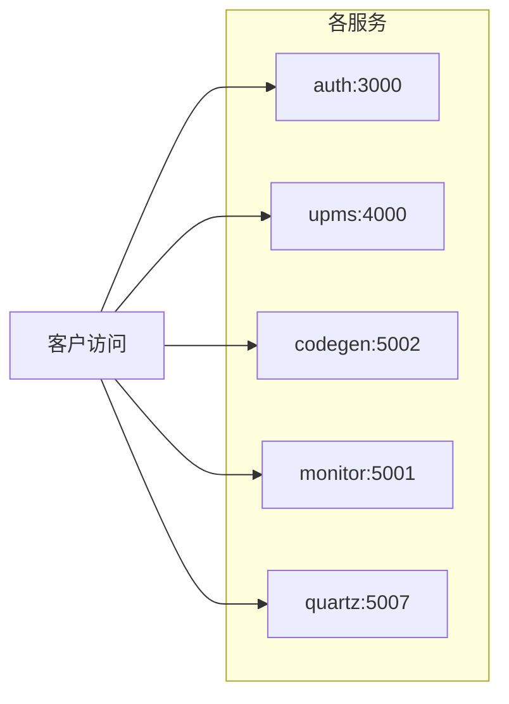
```mermaid
graph LR
    A[客户访问]

    subgraph 各服务
        B[auth:3000]
        C[upms:4000]
        D[codegen:5002]
        E[monitor:5001]
        F[quartz:5007]
    end

    A --> B
    A --> C
    A --> D
    A --> E
    A --> F
```

问题:
1. 客户端要记住5个地址! 😵
2. 每个服务都要自己做: 限流、跨域、日志... 😰
3. 服务换了地址, 所有客户端都要更新!

### 4.2 网关的三大核心功能

#### 1. 路由转发 (Router)

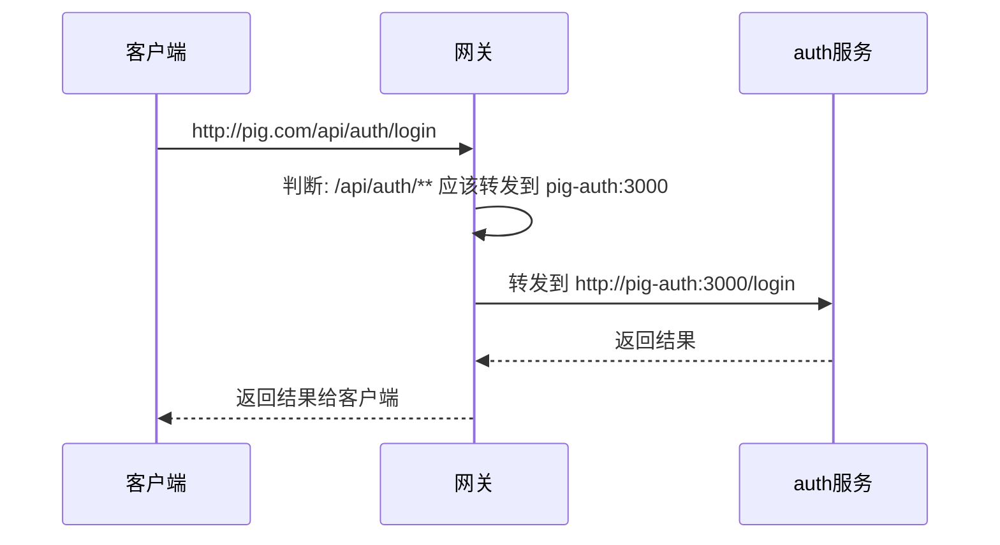
```mermaid
sequenceDiagram
    participant 客户端
    participant 网关
    participant auth服务

    客户端->>网关: http://pig.com/api/auth/login
    网关->>网关: 判断: /api/auth/** 应该转发到 pig-auth:3000
    网关->>auth服务: 转发到 http://pig-auth:3000/login
    auth服务-->>网关: 返回结果
    网关-->>客户端: 返回结果给客户端
```

配置示例 (`application.yml`):
```yaml
spring:
  cloud:
    gateway:
      routes:
        - id: auth_route         # 路由ID
          uri: lb://pig-auth     # 目标服务(Nacos中的服务名)
          predicates:            # 匹配规则
            - Path=/api/auth/**  # 路径匹配
        - id: upms_route
          uri: lb://pig-upms
          predicates:
            - Path=/api/admin/**
```

> 说明：`lb://pig-auth` 中的 `lb` 代表 Load Balance（负载均衡）。网关会根据这个服务名向 Nacos 查询 `pig-auth` 的实际地址（可能是多个实例），然后自动选择一个进行转发。这样即使 `pig-auth` 的 IP 或端口变化，网关也无需修改配置。

#### 2. 安全保护 (Security)

网关的安全校验实际分为两步：

- 提取 Token：从请求头 `Authorization: Bearer <token>` 中解析出 JWT。

- 校验 Token：网关并不会直接解析 JWT 内容，而是将 token 发送给 `pig-auth` 的 `/oauth2/introspect` 接口进行验证（避免网关持有私钥，且能检测 token 是否被吊销）。

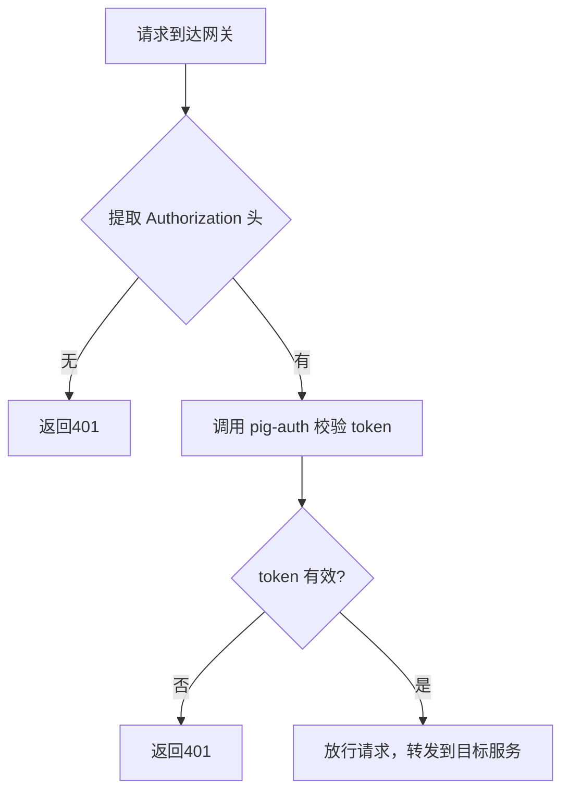
```mermaid
flowchart TD
    A[请求到达网关] --> B{提取 Authorization 头}
    B -->|无| C[返回401]
    B -->|有| D[调用 pig-auth 校验 token]
    D --> E{token 有效?}
    E -->|否| F[返回401]
    E -->|是| G[放行请求，转发到目标服务]
```

为什么网关要调用 auth 服务校验 token？

网关本身不持有私钥，无法解析 JWT 的签名，更无法判断 token 是否已被服务端吊销（如用户修改密码后作废旧 token）。因此，网关将 token 原样转发给 `pig-auth` 的 `/oauth2/introspect` 接口进行校验。

这个内部调用不会携带用户 token，因为 `pig-auth` 本身是认证服务，校验 token 的接口通常是公开的，或通过服务间认证（如 client credentials）进行保护，不会死循环。

如果 `pig-auth` 服务暂时不可用：网关会触发熔断（例如通过 Resilience4j 或 Sentinel 配置），快速返回 `503` 并提示“认证服务异常”，避免大量请求堆积导致雪崩。

#### 3. 限流熔断 (Rate Limit & Circuit Breaker)

场景1: 瞬间涌入10万请求
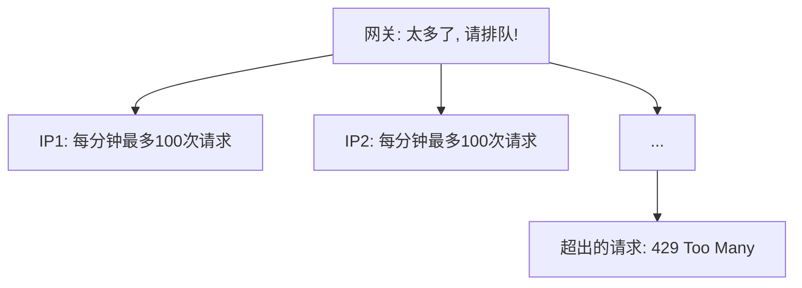
```mermaid
flowchart TD
    A["网关: 太多了, 请排队!"]
    B["IP1: 每分钟最多100次请求"]
    C["IP2: 每分钟最多100次请求"]
    D["..."]
    E["超出的请求: 429 Too Many"]

    A --> B
    A --> C
    A --> D
    D --> E
```

场景2: auth服务挂了
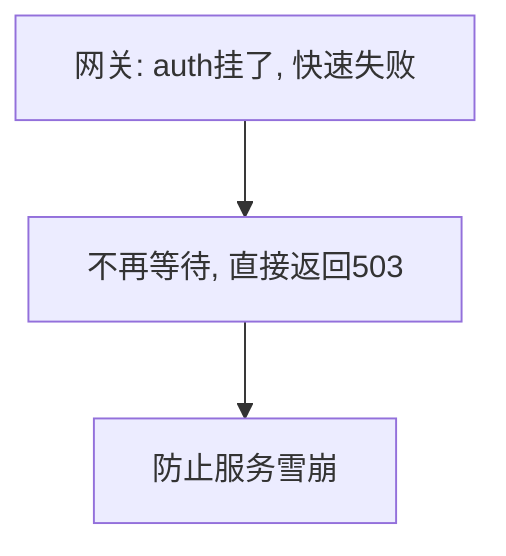
```mermaid
flowchart TD
    A["网关: auth挂了, 快速失败"]
    B["不再等待, 直接返回503"]
    C["防止服务雪崩"]

    A --> B
    B --> C
```

### 4.3 网关在PIG中的配置

客户端的请求流程:
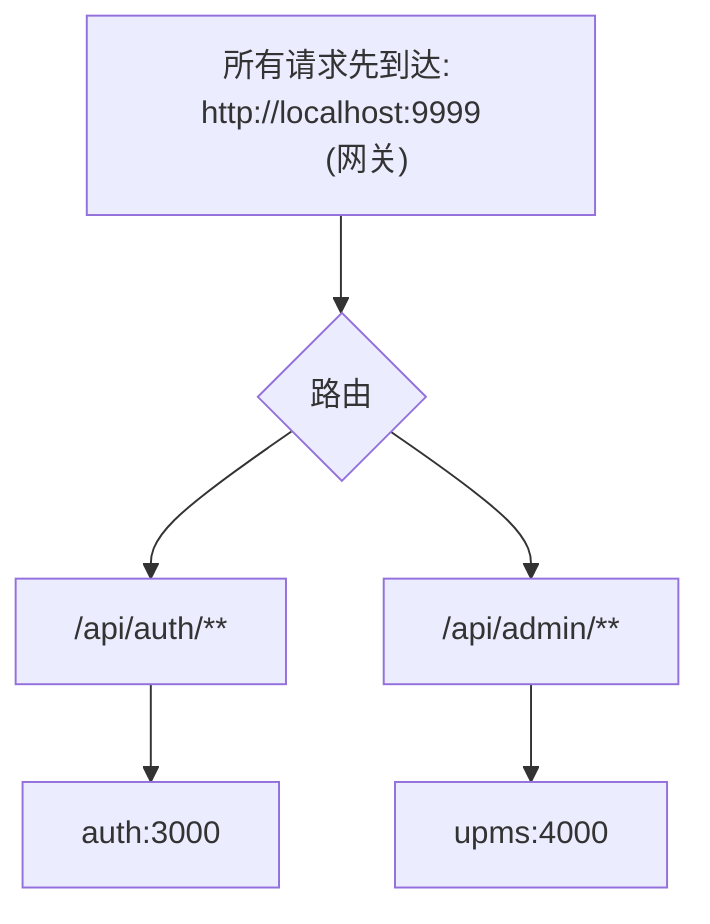
```mermaid
graph TD
    A["所有请求先到达: http://localhost:9999
      (网关)"] --> B{"路由"}
    B --> C["/api/auth/**"]
    B --> D["/api/admin/**"]
    C --> E["auth:3000"]
    D --> F["upms:4000"]
```

配置:
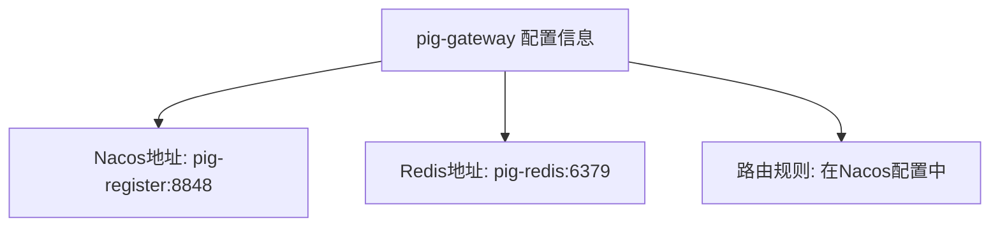
```mermaid
graph TD
    A[pig-gateway 配置信息]
    B[Nacos地址: pig-register:8848]
    C[Redis地址: pig-redis:6379]
    D[路由规则: 在Nacos配置中]

    A --> B
    A --> C
    A --> D
```

---

## 第五讲: 认证服务 - 安全的"门禁系统"

### 5.1 什么是认证(Authentication)?

**认证 = 证明"你是谁"**

类比: 你住的小区门禁
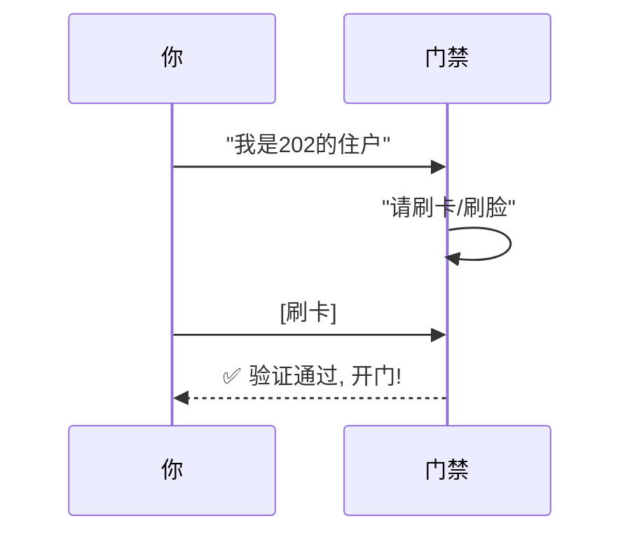
```mermaid
sequenceDiagram
    participant 你
    participant 门禁

    你->>门禁: "我是202的住户"
    门禁->>门禁: "请刷卡/刷脸"
    你->>门禁: [刷卡]
    门禁-->>你: ✅ 验证通过, 开门!
```

PIG中的认证:
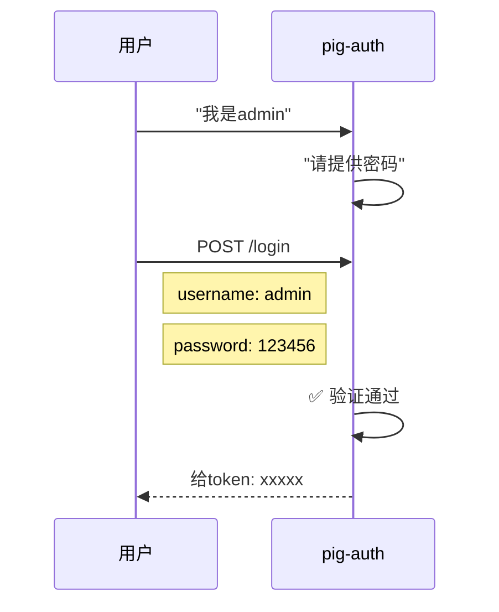
```mermaid
sequenceDiagram
    participant 用户
    participant pig-auth

    用户->>pig-auth: "我是admin"
    pig-auth->>pig-auth: "请提供密码"
    用户->>pig-auth: POST /login
    Note right of 用户: username: admin
    Note right of 用户: password: 123456
    pig-auth->>pig-auth: ✅ 验证通过
    pig-auth-->>用户: 给token: xxxxx
```

### 5.2 什么是授权(Authorization)?

**授权 = 决定"你能做什么"**
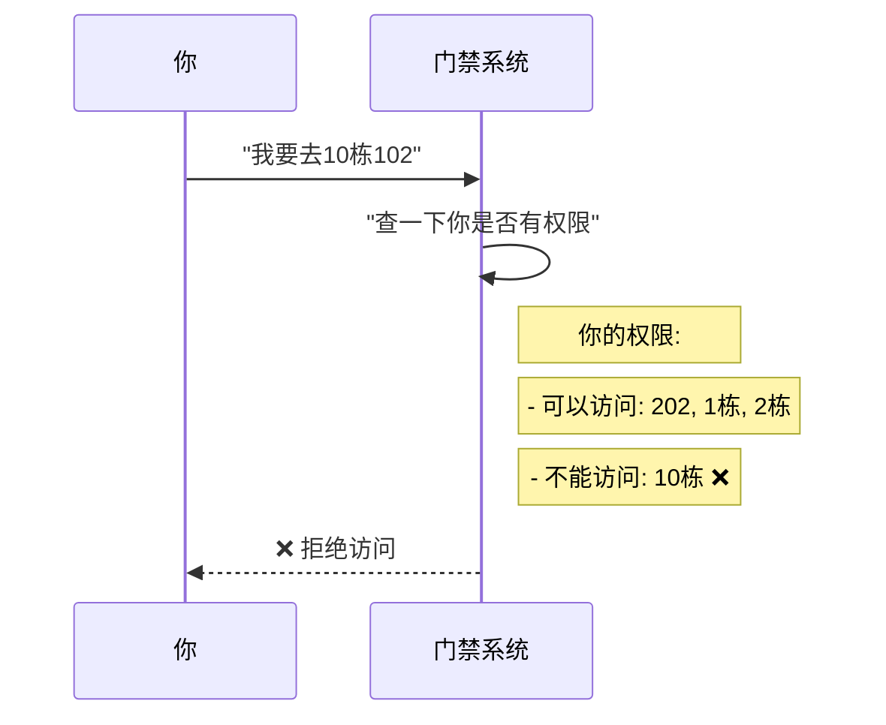
```mermaid
sequenceDiagram
    participant 你
    participant 门禁系统

    你->>门禁系统: "我要去10栋102"
    门禁系统->>门禁系统: "查一下你是否有权限"
    Note right of 门禁系统: 你的权限:
    Note right of 门禁系统: - 可以访问: 202, 1栋, 2栋
    Note right of 门禁系统: - 不能访问: 10栋 ❌
    门禁系统-->>你: ❌ 拒绝访问
```

PIG中的授权:
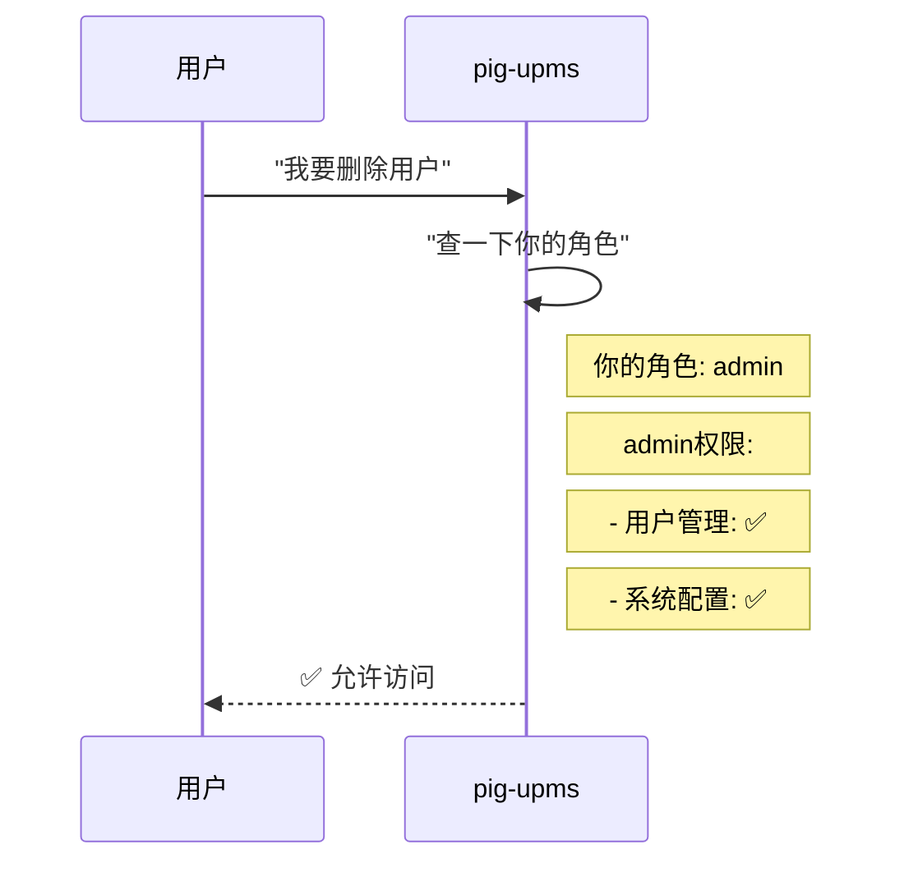
```mermaid
sequenceDiagram
    participant 用户
    participant pig-upms

    用户->>pig-upms: "我要删除用户"
    pig-upms->>pig-upms: "查一下你的角色"
    Note right of pig-upms: 你的角色: admin
    Note right of pig-upms: admin权限:
    Note right of pig-upms: - 用户管理: ✅
    Note right of pig-upms: - 系统配置: ✅
    pig-upms-->>用户: ✅ 允许访问
```

### 5.3 OAuth2 流程详解

PIG使用 OAuth2 标准协议, 流程是这样的:

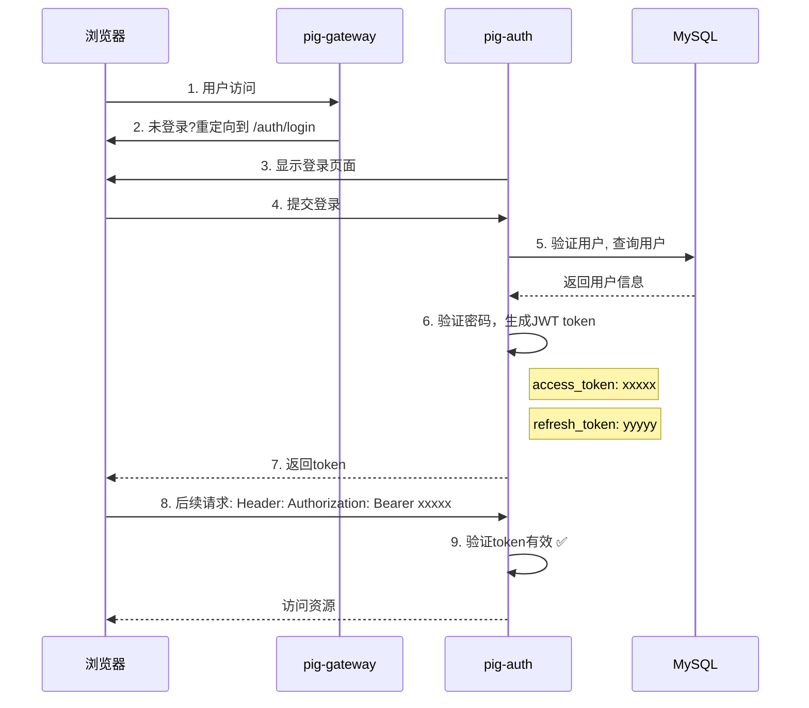
```mermaid
sequenceDiagram
    participant 浏览器
    participant pig-gateway
    participant pig-auth
    participant MySQL

    浏览器->>pig-gateway: 1. 用户访问
    pig-gateway->>浏览器: 2. 未登录?重定向到 /auth/login

    pig-auth->>浏览器: 3. 显示登录页面


    浏览器->>pig-auth: 4. 提交登录

    pig-auth->>MySQL: 5. 验证用户, 查询用户
    

    MySQL-->>pig-auth: 返回用户信息

    pig-auth->>pig-auth: 6. 验证密码，生成JWT token
    Note right of pig-auth: access_token: xxxxx
    Note right of pig-auth: refresh_token: yyyyy

    pig-auth-->>浏览器: 7. 返回token

    浏览器->>pig-auth: 8. 后续请求: Header: Authorization: Bearer xxxxx

    pig-auth->>pig-auth: 9. 验证token有效 ✅
    pig-auth-->>浏览器: 访问资源


```


**Token类型**:
- `access_token`: 使用令牌 (有效期短, 2小时)
- `refresh_token`: 刷新令牌 (有效期长, 7天)
- `scope`: 权限范围 (openid read write)

### 5.4 Pig-Auth 的核心功能

将自己注册到Nacos:
```java
// PigAuthApplication.java
@SpringBootApplication
@EnableDiscoveryClient // 注册到Nacos
public class PigAuthApplication {
    public static void main(String[] args) {
        SpringApplication.run(PigAuthApplication.class, args);
    }
}
```

说明： `@EnableDiscoveryClient` 告诉 Spring Cloud 该应用需要向注册中心注册自己。即使不写这个注解，只要 `classpath` 下有 Nacos 依赖，服务也会自动注册，但显式声明能让代码意图更明确。

主要API端点:
```text
POST /oauth2/token          // 获取token
POST /oauth2/authorize      // 授权码授权
POST /oauth2/introspect     // token校验
POST /oauth2/revoke         // token撤销
GET  /oauth2/jwks           // 公钥获取
```

支持的授权模式:
1. `password`: 用户名密码登录 (最常用)
2. `authorization_code`: 授权码模式
3. `client_credentials`: 客户端模式
4. `refresh_token`: 刷新token

Pig 主要使用 `password` 模式（适用于前后端分离的应用），即用户直接提供用户名密码换取 token。`authorization_code` 模式通常用于第三方应用授权（如“使用微信登录”），在本项目中可忽略。`refresh_token` 模式用于 `access_token` 过期后刷新，实现无感续期。


---

## 第六讲: 业务服务 - 系统的"大脑"

### 6.1 什么是业务服务?

以 `pig-upms` 为例: **User Permission Management System (用户权限管理系统)**

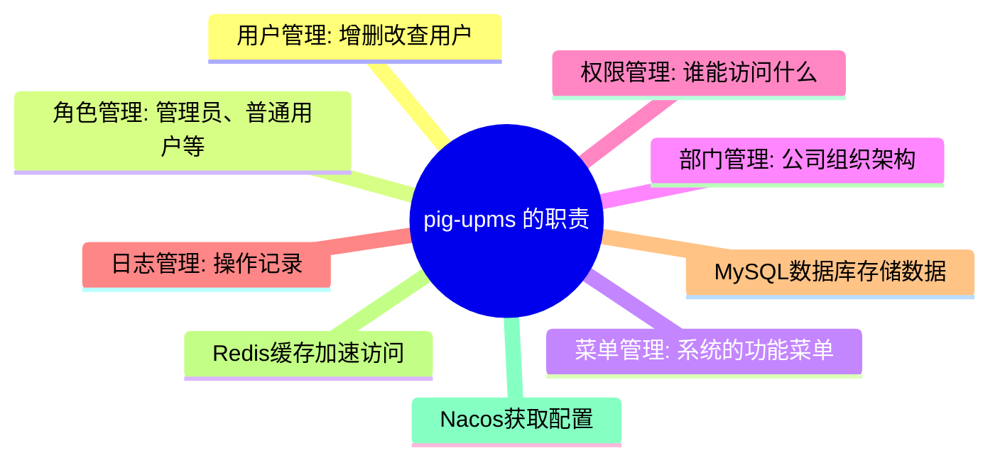
```mermaid
mindmap
  root((pig-upms 的职责))
    用户管理: 增删改查用户
    角色管理: 管理员、普通用户等
    菜单管理: 系统的功能菜单
    部门管理: 公司组织架构
    权限管理: 谁能访问什么
    日志管理: 操作记录
    MySQL数据库存储数据
    Redis缓存加速访问
    Nacos获取配置
```

### 6.2 pig-upms 的代码结构

```
pig-upms/
├── pig-upms-api/ # API模块
│   └── src/main/java/
│       └── com/pig4cloud/pig/admin/api/
│           ├── dto/   # 数据传输对象
│           ├── vo/    # 值对象
│           └── feign/ # Feign客户端接口
│
└── pig-upms-biz/ # 业务实现模块
    └── src/main/java/
        └── com/pig4cloud/pig/admin/
            ├── controller/ # 控制器 (接收请求)
            ├── service/    # 服务层 (业务逻辑)
            ├── mapper/     # 数据访问层
            └── entity/     # 实体类
```

为什么要拆分出 `api` 和 `biz` 两个包？

> 假设 “商品服务” 想要通过 Feign 调用 “用户服务” 的 `getUserById` 接口。
>
> 如果不拆分： “商品服务” 必须引入整个 “用户服务” 的依赖。结果就是，“商品服务” 还没启动，就先背上了 “用户服务” 的数据库驱动、业务逻辑、甚至是权限配置。这叫依赖污染，会导致 Jar 包巨大，且容易产生版本冲突。
>
> 拆分后： “商品服务” 只需要依赖 `pig-upms-api`。这个包里只有几个接口定义和简单的 DTO，非常干净，“商品服务” 只需要知道“怎么调”就行了，不需要知道“怎么实现”。
>
> 如果你写过 C/C++ 的项目，那么你很快就能意识到，他们就相当于头文件和源码文件之间的关系。

为什么 `pig-gateway` 没有进一步拆分模块？

> 在 PIG 中，你会发现有些模块是“单身”的。请记住：API 模块是给“调用者”准备的。
>
> 如果一个模块（如网关）处于流量的终点或入口，没有其他服务会反向调用它，那么拆分 API 纯属浪费时间。架构设计的核心是**“按需拆分”**，而不是为了拆分而拆分。所以通常只对业务模块进行拆分。

典型Controller代码:
```java
@RestController // @RestController = @Controller + @ResponseBody
@RequestMapping("/user") // 请求前缀
@RequiredArgsConstructor // Lombok自动生成构造器
public class SysUserController {

    private final SysUserService userService; // 注入Service

    /**
     * 分页查询用户列表
     *
     * @param page  页码
     * @param size  每页条数
     * @return 用户列表
     */
    @GetMapping("/page") // GET /user/page?page=1&size=10
    public R<IPage<SysUser>> getUserPage(
            @RequestParam(required = false) Integer page,
            @RequestParam(required = false) Integer size) {

        IPage<SysUser> userPage = userService.page(
            new Page<>(page, size)
        );

        return R.ok(userPage); // 返回成功结果
    }

    /**
     * 新增用户
     *
     * @param user 用户信息
     * @return 操作结果
     */
    @PostMapping // POST /user
    public R<Boolean> addUser(@RequestBody SysUser user) {
        return R.ok(userService.save(user));
    }
}
```

权限注解 `@PreAuthorize` 是怎么知道当前用户是谁的？

> `@PreAuthorize("hasRole('ADMIN')")` 注解在执行方法前，会从 `SecurityContextHolder` 中取出当前用户的 `Authentication` 对象，并调用其 `getAuthorities()` 方法检查是否包含 `ROLE_ADMIN` 权限。
>
> 因此，只要你在业务服务中正确配置了 Spring Security 和 JWT 解析，注解就能自动生效。

### 6.3 业务流程: 查询用户列表

> tips: 如果图中字太小看不清可以用双指缩放网页（触摸板也行）

```mermaid
sequenceDiagram
    participant 浏览器
    participant 网关
    participant pig-upms
    participant MySQL

    浏览器->>网关: 1. GET /api/admin/user/page?page=1&size=10
    Note right of 浏览器: Header: Authorization: Bearer xxxx

    网关->>网关: 2. 校验token ✅

    网关->>pig-upms: 3. 转发到: pig-upms:4000/user/page

    pig-upms->>pig-upms: 4. Controller接收请求
    Note right of pig-upms: 调用UserService

    pig-upms->>pig-upms: 5. Service调用Mapper层

    pig-upms->>MySQL: 6. Mapper执行SQL

    MySQL-->>pig-upms: 7. MyBatis Plus 自动映射结果到实体类

    pig-upms->>pig-upms: 8. 返回: Page对象(总条数, 当前页数据)

    pig-upms->>网关: 9. Controller包装成 R.ok() 响应并返回 JSON

    网关->>浏览器: 10. 返回最终结果
```

---

## 第七讲: 一次请求的完整旅程

### 7.1 场景: 用户要查看用户列表

**角色**:
- 用户: Alice (admin/123456)
- 权限: 管理员 (拥有用户管理权限)

**目标**: Alice要查看系统中的用户列表

---

### 第1步: 用户登录获取Token

```mermaid
sequenceDiagram
    participant Alice
    participant 浏览器
    participant pig-gateway
    participant pig-auth
    participant MySQL

    Alice->>浏览器: 输入: http://localhost:9999
    浏览器->>浏览器: 显示登录表单
    Alice->>浏览器: 输入: admin / 123456
    浏览器->>pig-gateway: POST /api/auth/oauth2/token

    pig-gateway->>pig-gateway: 1. 收到 /api/auth/oauth2/token 请求
    pig-gateway->>pig-gateway: 2. 路由规则: /api/auth/** → lb://pig-auth

    pig-gateway->>pig-gateway: 3. 从Nacos获取 pig-auth 的地址: 3000
    pig-gateway->>pig-auth: 4. 转发到 http://pig-auth:3000/token

    pig-auth->>MySQL: 5. 从数据库查询用户: admin

    MySQL-->>pig-auth: 返回用户信息
    pig-auth->>pig-auth: 6. 比对密码: BCrypt.matches
    pig-auth->>pig-auth: 7. 密码正确 ✅
    pig-auth->>MySQL: 8. 查询用户角色和权限
    pig-auth->>pig-auth: 9. 生成JWT token
    pig-auth->>pig-auth: 10. 私钥签名生成access_token & refresh_token

    pig-auth-->>pig-gateway: 返回token

    pig-gateway-->>浏览器: 返回token
    浏览器->>浏览器: 存储token (localStorage)
    浏览器->>Alice: 显示: "登录成功!"
```

---

### 第2步: 请求用户列表 (已认证)

```mermaid
sequenceDiagram
    participant Alice
    participant 浏览器
    participant pig-gateway
    participant pig-auth
    participant pig-upms
    participant MySQL

    Alice->>浏览器: 点击菜单: "用户管理"
    浏览器->>pig-gateway: GET /api/admin/user/page?page=1&size=10
    Note right of 浏览器: Headers: {"Authorization": "Bearer eyJhbGciOiJ..."}

    pig-gateway->>pig-gateway: 过滤器链执行顺序:
    pig-gateway->>pig-gateway: 1. 路由: /api/admin/** → pig-upms
    pig-gateway->>pig-gateway: 2. 限流: 检查IP是否超限
    pig-gateway->>pig-gateway: 3. 跨域: 处理CORS
    pig-gateway->>pig-gateway: 4. 令牌解析: 从请求头提取 Bearer token
    pig-gateway->>pig-auth: 5. 令牌校验: GET /auth/introspect?token=xxx
    pig-auth-->>pig-gateway: pig-auth返回: active=true
    pig-gateway->>pig-gateway: 6. 结果: ✅ token有效
    pig-gateway->>pig-upms: 7. 转发到: pig-upms:4000/user/page

    pig-upms->>pig-upms: Controller层: SysUserController.getUserPage()
    pig-upms->>pig-upms: @PreAuthorize("hasRole('ADMIN')")
    pig-upms->>pig-upms: 检查权限: admin ✓
    pig-upms->>pig-upms: Service层: userService.page()
    pig-upms->>pig-upms: Mapper层: baseMapper.selectPage()

    pig-upms->>MySQL: SQL执行

    MySQL-->>pig-upms: 结果: Page对象

    pig-upms-->>pig-gateway: 返回数据 (JSON格式)

    pig-gateway-->>浏览器: 返回数据
    浏览器->>浏览器: 渲染表格
    浏览器->>Alice: 显示用户列表
```

---

### 第3步: Token 过期后续期

```mermaid
sequenceDiagram
    participant Alice
    participant 浏览器
    participant pig-gateway
    participant pig-auth

    Alice->>浏览器: 再次请求: GET /api/admin/user/page
    浏览器->>pig-gateway: Header: Authorization: Bearer (old_token)

    pig-gateway->>pig-gateway: ❌ token已过期 (exipred)
    pig-gateway-->>浏览器: 返回401

    浏览器->>浏览器: 收到401, 自动用 refresh_token 换新的
    浏览器->>pig-auth: POST /auth/oauth2/token
    Note right of 浏览器: grant_type=refresh_token
    Note right of 浏览器: refresh_token=yyyyy...

    pig-auth->>pig-auth: 验证 refresh_token 有效 ✅
    pig-auth-->>浏览器: 返回新的 token

    浏览器->>浏览器: 保存新token
    浏览器->>pig-gateway: 重试之前的请求
    pig-gateway-->>浏览器: ✅ 返回用户列表
```

> 重要提示:
> - `refresh_token` 只能用一次, 用后作废
> - `refresh_token` 也过期后, 需要重新登录

---

## 第八讲: 总结与最佳实践

### 8.1 微服务核心概念总结

#### 🔄 1. 服务注册与发现 (Nacos)

```mermaid
graph TD

    subgraph new["新方法"]
        D["服务A问Nacos: B在哪里?"]
        E["Nacos返回: [B1:8080, B2:8081]"]
        F[服务A拿到地址调用]
        G["优点: B地址变了自动更新, A无感知"]
    end

    subgraph old["老方法"]
        B["服务A在配置文件写死B的地址"]
        C["问题: B换了地址, A也要重启"]
    end

    B --> C

    D --> E
    E --> F
    F --> G
```

代码示例:

在调用方（如 `pig-gateway` ）的 `pom.xml` 中添加依赖：

```xml
<dependency>
    <groupId>org.springframework.cloud</groupId>
    <artifactId>spring-cloud-starter-openfeign</artifactId>
</dependency>
```

在启动类上添加 `@EnableFeignClients`：

```java
@EnableFeignClients
@SpringBootApplication
public class PigGatewayApplication { ... }
```

定义 Feign 客户端接口（可以放在公共模块中）：

```java
@FeignClient("pig-upms") // 不用写具体地址!
public interface SysUserClient {

    @GetMapping("/user/{id}")
    R<SysUser> getUserById(@PathVariable("id") Long id);
}
```

在需要调用的地方注入并使用：

```java
@Autowired
private SysUserClient userClient;

public void test() {
    // 框架自动从Nacos获取pig-upms地址并调用
    R<SysUser> result = userClient.getUserById(1L);
}
```

注意：Feign 会自动处理负载均衡和服务发现，无需关心具体 IP 地址。

#### 🌐 2. API 网关 (Gateway)

```mermaid
flowchart TD
    A[核心: 统一入口 + 通用功能]

    subgraph 网关功能
        B[1. 路由: /api/auth → auth服务]
        C[2. 安全: 校验token]
        D[3. 限流: 防止恶意请求]
        E[4. 日志: 记录访问日志]
        F[5. 跨域: 处理CORS]
        G[6. 熔断: 服务挂了快速失败]
    end

    A --> B
    A --> C
    A --> D
    A --> E
    A --> F
    A --> G
```

秒杀场景:
```mermaid
graph TD
    A[QPS: 10万/秒] --> B[网关限流: 只放行1万/秒]
    B --> C[返回 429 Too Many Request 给剩下的9万个请求]
    C --> D[防止后端服务被压垮]
```

#### 🔐 3. 认证授权 (OAuth2 + JWT)

```mermaid
flowchart TD
    A[核心: 无状态认证]

    subgraph JWT方案
        H[登录成功 → 服务端签发token]
        I[返回token给客户端]
        J[客户端存token → 每次请求带token]
        K[服务端验证token签名 ✅]
        L[优点: 服务端无状态, 可水平扩展]
    end

    A --> H
    H --> I
    I --> J
    J --> K
    K --> L
```

### 8.2 实际项目中常见问题

#### Q1: 如何在服务间传递用户信息?

```mermaid
sequenceDiagram
    participant pig-upms
    participant pig-auth

    pig-upms->>pig-auth: 调用/user/info
    Note right of pig-upms: @RequestHeader("Authorization") String token
    Note right of pig-upms: 传递当前用户的token
    pig-upms->>pig-auth: authClient.getUserInfo(request.getHeader("Authorization"))
```

#### \*Q2: 分布式事务怎么处理?

> *\***⚠️进阶内容**：此问题为进阶内容，初学者可跳过*

在微服务架构中，一个业务操作可能涉及多个服务（如创建订单需要同时扣减库存）。如何保证这些操作的数据一致性是一个难题。

常见解决方案：

- 最终一致性：通过消息队列（如 RocketMQ、RabbitMQ）实现，允许短暂不一致，最终达到一致。

- 强一致性：使用分布式事务框架（如 Seata）实现，采用 `@GlobalTransactional` 注解保证所有操作要么全部成功，要么全部回滚。

```mermaid
sequenceDiagram
    participant Seata
    participant MySQL
    participant Redis
    participant MQ

    Seata->>MySQL: userMapper.insert(user)
    Seata->>Redis: redisCache.put(user)
    Seata->>MQ: messageSender.send(user)
    Note right of Seata: @GlobalTransactional
    Note right of Seata: 要么全部成功, 要么全部回滚
```

#### Q3: 如何调试分布式系统?

```mermaid
graph TD
    A[技巧1: 服务启动顺序很重要]
    A --> B[1. mysql、redis基础服务]
    A --> C[2. pig-register Nacos]
    A --> D[3. 其他服务 gateway, auth, upms...]

    E[技巧2: 查看Nacos确认服务是否注册成功]
    E --> F[访问: http://localhost:8848]

    G[技巧3: 查看日志]
    G --> H[每个服务的 logback-spring.xml配置]

    I[技巧4: 链路追踪]
    I --> J[Spring Cloud Sleuth + Zipkin]
```

#### Q4: 配置文件这么多, 如何管理?

```mermaid
graph TD
    A[pig-upms/src/main/resources]
    B[application.yml主配置]
    C[application-dev.yml开发环境]
    D[application-test.yml测试环境]
    E[application-prod.yml生产环境]

    A --> B
    A --> C
    A --> D
    A --> E

    A --> G[spring.cloud.nacos.discovery.server-addr: 8848]
    A --> H[spring.cloud.nacos.config.server-addr: 8848]
```

最佳实践:
- 敏感信息(密码)用Jasypt加密
- 不同环境用不同配置
- 公共配置放Nacos

#### Q5: 我能在 IDEA 里启动部分服务，用 Docker 启动其他服务吗？

可以，但需要注意网络互通。Docker Compose 会为服务创建一个默认网络（如 `spring_cloud_default`），而 IDE 启动的应用运行在宿主机网络。要让它们互相发现，有两种常见方案：

1. 全部在 IDE 中启动：本地启动 Nacos、MySQL、Redis 等基础服务（可用 Docker 单独运行），然后逐个启动微服务，所有服务都使用 `localhost` 或 `127.0.0.1` 作为注册中心地址。

2. 全部用 Docker Compose 启动：适合集成测试或生产环境，简单一键启动。

如果混用，需确保 Docker 容器能够访问宿主机上的服务。例如，在 IDE 中启动的 `pig-auth` 要注册到 Docker 里的 Nacos，应配置 Nacos 地址为宿主机 IP（如 `192.168.x.x`），而不是 `localhost`，因为容器内的 `localhost` 指向容器自身。

开发建议：新手可以先在 IDE 中启动所有服务（通过 `main` 方法），这样方便调试和观察日志；熟悉后再过渡到 Docker Compose。

### 8.3 学习路线图

#### 第一阶段: 单点理解

目标：
- 理解每个组件的作用

学习内容：
- `pig-register`：Nacos服务注册发现
- `pig-gateway`：Spring Cloud Gateway路由
- `pig-auth`：OAuth2认证流程
- `pig-upms`：用户权限管理CRUD
- `pig-common`：公共组件
- `pig-visual`：监控（可选）

实践：
- 启动单个服务测试
- 用Postman手动调用接口
- 查看Nacos中的服务列表

#### 第二阶段: 流程串联

目标：
- 理解完整请求流程

学习内容：
- 登录 → 获取token → 携带token访问 → 权限校验
- 服务互相调用（Feign）
- 配置动态刷新（`@RefreshScope`）
- 统一异常处理
- 日志链路追踪

实践：
- `DEBUG` 模式跟踪一个完整请求
- 在Nacos修改配置观察动态刷新
- 制造异常看全局异常处理器

#### 第三阶段: 生产优化

目标：
- 项目优化与调优

学习内容：
- JVM参数调优
- 数据库连接池配置（HikariCP）
- Redis缓存策略
- 限流熔断配置
- 日志级别与分割
- 多环境配置（dev/test/prod）

实践：
- 配置不同环境的参数
- 压力测试看性能瓶颈
- 查看Actuator监控指标

### 8.4 从初学者到中级开发者

#### 你应该理解:

1. **为什么需要微服务?**
   - 单体 → 拆分的动机 (扩展性、可用性、灵活性)

2. **Spring Cloud核心组件?**
   - Gateway: 统一入口
   - Nacos: 服务注册与配置
   - Sentinel/Resilience4j: 限流熔断
   - LoadBalancer: 负载均衡

3. **OAuth2 认证流程?**
   - 登录 → token → 携带token访问 → 校验 → 返回结果
   - access_token vs refresh_token

4. **实际开发流程?**
   - 需求分析 → Controller → Service → Mapper → 测试

5. **如何调试?**
   - 日志、断点、Postman、浏览器F12

6. **常见问题处理?**
   - token过期、权限不足、网络超时、配置错误

#### 你应该能独立完成:

1. 新增一个业务模块
2. 编写CRUD接口
3. 配置文件管理
4. Docker部署
5. 接口文档编写 (Swagger)
6. 单元测试和集成测试

### 8.5 进一步学习资源

#### 官方文档

- [Spring Boot](https://spring.io/projects/spring-boot)
- [Spring Cloud](https://spring.io/projects/spring-cloud)
- [Spring Cloud Alibaba](https://sca.aliyun.com/)
- [MyBatis Plus](https://baomidou.com)

#### 社区

- [Pig](https://gitee.com/log4j/pig)
- Spring 中文社区
- 技术博客: 掘金、思否、CSDN

---

## 附录

### A. 核心注解速查表

| 注解 | 作用 | 示例 |
|------|------|------|
| `@SpringBootApplication` | 启动类 | `main()`方法上 |
| `@EnableDiscoveryClient` | 服务注册 | 启动类上 |
| `@RestController` | 声明控制器 | Controller类上 |
| `@RequestMapping` | 映射路径 | `类和方法上` |
| `@GetMapping/PostMapping` | HTTP方法 | 方法上 |
| `@PathVariable` | 路径参数 | `/user/{id}` |
| `@RequestParam` | 请求参数 | `?page=1` |
| `@RequestBody` | 请求体 | POST JSON |
| `@PreAuthorize` | 权限控制 | 方法上 |
| `@Validated` | 参数校验 | Controller类上 |
| `@Service` | 声明服务 | Service类上 |
| `@Mapper` | 声明Mapper | Mapper接口上 |
| `@Data` | Lombok | 实体类上 |
| `@Slf4j` | 日志对象 | 任意类上 |

### B. 端口速查表

| 服务 | 端口 | 说明 |
|------|------|------|
| Nacos | 8848/9848 | 注册中心 |
| Gateway | 9999 | 统一入口 |
| Auth | 3000 | 认证服务 |
| UPMS | 4000 | 用户权限 |
| Monitor | 5001 | 监控 |
| Codegen | 5002 | 代码生成 |
| Quartz | 5007 | 定时任务 |
| MySQL | 33306 | 数据库 |
| Redis | 36379 | 缓存 |

### C. 常用命令

```bash
# 启动所有服务 (docker-compose.yml所在目录)
docker compose up -d

# 查看日志
docker compose logs -f pig-gateway
docker compose logs -f pig-auth

# 停止服务
docker compose stop

# 查看容器状态
docker compose ps

# 进入容器内部
docker exec -it pig-mysql bash
mysql -uroot -proot

# 查看网络
docker network ls
docker network inspect spring_cloud_default

# 单独启动某个服务
docker compose up -d pig-auth
```

### D. 常见问题FAQ

#### Q: 服务启动失败?

```mermaid
flowchart TD
    A[检查顺序:]
    B[1. MySQL和Redis是否启动?
      docker ps]
    C[2. Nacos是否启动?能否访问8848?]
    D[3. 查看日志: docker logs 容器名]
    E[4. 检查配置: application.yml中的Nacos地址]
    F[5. 检查端口是否被占用]

    A --> B
    A --> C
    A --> D
    A --> E
    A --> F
```

#### Q: 401 Unauthorized?

A1: token过期了? 重新登录
A2: 权限不足? `@PreAuthorize`配置的权限
A3: 没有带`Authorization`头?
A4: token格式不对? 应该是 `Bearer xxx`

#### Q: 503 Service Unavailable?

A: 服务挂了
1. `docker ps` 查看容器状态
2. 查看服务日志
3. 检查Nacos中服务是否注册成功
4. 检查数据库连接

#### Q: 如何新增一个业务模块?

步骤详解：

1. 创建模块：在 IDEA 中右键项目根目录 → New → Module → Maven，输入 `artifactId` 为 `pig-xxx`（如 `pig-demo`）。
2. 配置依赖：在新模块的 `pom.xml` 中引入 `pig-common` 和 Spring Boot 基础依赖。在根模块的 `pom.xml` 中 `<modules>`里新增子模块的名称。
3. 编写启动类：
```java
@SpringBootApplication
@EnableDiscoveryClient
public class PigDemoApplication {
    public static void main(String[] args) {
        SpringApplication.run(PigDemoApplication.class, args);
    }
}
```
4. 添加配置：在 `src/main/resources` 下创建 `application.yml`，指定端口、应用名、Nacos 地址等。
5. 编写业务代码：创建 Controller、Service、Mapper 等（参考 `pig-upms-biz` 的结构）。
6. 添加网关路由：在 Nacos 的网关配置（`pig-gateway` 的配置）中添加新的路由规则，将 `/api/demo/**` 转发到 `lb://pig-demo`。
7. 修改 `docker-compose.yml`：增加新服务的定义，使其能被容器编排启动。
8. 启动测试：重新 `docker compose up -d`，观察服务是否注册到 Nacos，通过网关访问接口。

### E. 最小化启动指南（IDE 方式）

如果你想尽快把项目跑起来，而不想一开始就接触 Docker，可以按以下步骤操作：

1. 准备环境：
- 安装 JDK 17
- 安装 MySQL 8.0+ 和 Redis（可下载安装包或使用 Docker 快速启动，但此步骤简单）
- 获取项目源码

2. 启动基础服务：
- 启动 MySQL（并创建数据库）
- 启动 Redis（默认端口 6379）

3. 启动 Nacos：
- 进入 `pig-register` 目录，运行 `mvn spring-boot:run`（或直接运行 `PigRegisterApplication` 的 `main` 方法）
- 访问 `http://localhost:8848/nacos` 确认启动成功

4. 修改配置文件：
- 依次修改 `pig-gateway`、`pig-auth`、`pig-upms` 等服务的配置文件（通常是 `application.yml`），确保 Nacos 地址指向 `localhost:8848`
- 检查数据库、Redis 地址是否为 `localhost`

5. 按顺序启动微服务：
- 先启动 `pig-gateway`
- 再启动 `pig-auth`
- 最后启动 `pig-upms` 等业务服务

6. 测试：
- 用 Postman 访问 `http://localhost:9999/api/auth/oauth2/token` 进行登录，获取 token
- 携带 token 访问业务接口，查看是否返回数据

---

## 恭喜你!

如果你已经读到这里, 说明你已经:

- ✅ 理解了微服务架构的基本概念
- ✅ 掌握了PIG项目整体架构
- ✅ 了解了各服务的作用
- ✅ 清楚了完整请求流程
- ✅ 知道了常见问题的解决方案

### 下一步行动:

1. **动手实践**: 启动项目, 用Postman测试接口
2. **Debug调试**: 设置断点, 跟踪请求流程
3. **查看源码**: 在关键地方加日志理解执行顺序
4. **尝试开发**: 新增一个CRUD接口
5. **深入理解**: 阅读Spring Cloud官方文档

### 学习建议:

- **不要急于求成**: 分布式系统比单体复杂, 需要循序渐进
- **多动手**: 理论+实践才能真正理解
- **多看日志**: 日志是最好的老师
- **多问为什么**: 每个设计都有原因
- **加入社区**: 和其他开发者交流

---

## 致谢

- Pig项目作者: lengleng
- Spring社区
- 所有开源贡献者

---

**最后的话**:

> 微服务架构就像搭积木, 每个服务是一个积木块, 看似简单的组合, 却能构建出强大的系统。希望这个教程能帮助你迈过初学者的门槛, 成为一名优秀的分布式系统开发者!

加油! 💪

<script src="https://cdn.jsdelivr.net/npm/svg-pan-zoom@3.6.1/dist/svg-pan-zoom.min.js"></script>
<script src="https://cdn.jsdelivr.net/npm/hammerjs@2.0.8/hammer.min.js"></script>

<script>
document.addEventListener("DOMContentLoaded", function() {
    const checkMermaid = setInterval(() => {
        const svgs = document.querySelectorAll('.mermaid svg');
        if (svgs.length > 0) {
            clearInterval(checkMermaid);

            svgs.forEach((svg) => {
                // 容器样式调整
                const container = svg.parentElement;
                container.style.height = "400px"; // 设定一个合适的高度
                container.style.border = "1px solid #eee";
                container.style.position = "relative";

                // 初始化全功能缩放
                const panZoom = svgPanZoom(svg, {
                    zoomEnabled: true,
                    controlIconsEnabled: true,
                    fit: true,
                    center: true,
                    customEventsHandler: {
                        haltEventListeners: ['touchstart', 'touchend', 'touchmove', 'touchleave', 'touchcancel'],
                        init: function(options) {
                            var instance = options.instance,
                                initialScale = 1,
                                pannedX = 0,
                                pannedY = 0;

                            // 使用 Hammer.js 处理触摸事件
                            this.hammer = Hammer(options.svgElement, {
                                inputClass: Hammer.SUPPORT_POINTER_EVENTS ? Hammer.PointerEventInput : Hammer.TouchInput
                            });

                            this.hammer.get('pinch').set({enable: true});

                            // 处理双指缩放
                            this.hammer.on('pinchstart', function(ev) {
                                initialScale = instance.getZoom();
                                instance.zoomAtPoint(initialScale * ev.scale, {x: ev.center.x, y: ev.center.y});
                            });

                            this.hammer.on('pinchmove', function(ev) {
                                instance.zoomAtPoint(initialScale * ev.scale, {x: ev.center.x, y: ev.center.y});
                            });

                            // 处理滑动（Pan）
                            this.hammer.on('panstart panmove', function(ev) {
                                if (ev.type === 'panstart') {
                                    pannedX = 0;
                                    pannedY = 0;
                                }
                                instance.panBy({x: ev.deltaX - pannedX, y: ev.deltaY - pannedY});
                                pannedX = ev.deltaX;
                                pannedY = ev.deltaY;
                            });

                            // 阻止手机浏览器默认的滚动行为（当在图表上操作时）
                            options.svgElement.addEventListener('touchmove', function(e) { e.preventDefault(); }, {passive: false});
                        },
                        destroy: function() {
                            this.hammer.destroy();
                        }
                    }
                });
            });
        }
    }, 500);
});
</script>

<style>
  .mermaid {
    /* 解决滑动冲突，确保用户可以划过图表区域而不会卡住页面滚动 */
    touch-action: none;
  }
  .mermaid svg {
    width: 100% !important;
    height: 100% !important;
    max-width: none !important;
  }
</style>

